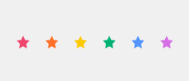

# Queer Icons

A collection of rainbow icons to be used for LGBTQ+ content or by anyone who loves colorful icons.
(Currently, the collection is a first draft of stars, there will be many more icons added.)

### Colors used:

- <span style='color: #f0456cff' >Red (f0456cff)</span>
- <span style='color: #ff702aff' >Orange (ff702aff)</span>
- <span style='color: #fec901ff' >Yellow (fec901ff)</span>
- <span style='color: #00b274ff' >Green (00b274ff)</span>
- <span style='color: #5295feff' >Blue (5295feff)</span>
- <span style='color: #d66fe5ff' >Purple (d66fe5ff)</span>



### Installation

```
npm install queer-icons --save
```

### Usage

Import the stylesheet to your `html` file:
```
<link rel="stylesheet" href="node_modules/queer-icons/dist/queer-icons.css">
```

Use class names for icons:

```
<i class="qi qi-star-red"></i>
```

### License

- queer-icons are open-sourced (MIT)
